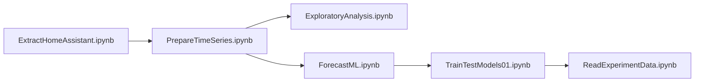

# indoor-co2-forecast

A set of notebooks that:
- extract a history of CO2 sensor readings,
- use several ML algorithms to train on the dataset in order to predict a future value,
- log the runs in mlflow,
- choose the feature set, model, and model parameters with the best predicting power.  

## List of the notebooks

| Notebook | Purpose |
|---------|---------|
| [ExtractHomeAssistant.ipynb](notebooks/ExtractHomeAssistant.ipynb) | Ingest data from source |
| [PrepareTimeSeries.ipynb](notebooks/PrepareTimeSeries.ipynb) | Preprocess data|
| [ExploratoryAnalysis.ipynb](notebooks/ExploratoryAnalysis.ipynb) | Perform exploratory data analysis |
| [ForecastML.ipynb](notebooks/ForecastML.ipynb) | Engineer features |
| [TrainTestModels01.ipynb](notebooks/TrainTestModels01.ipynb) | Run and log experiments |
| [ReadExperimentData.ipynb](notebooks/ReadExperimentData.ipynb) | Read logs and select the best run |

## DAG for running the notebooks

